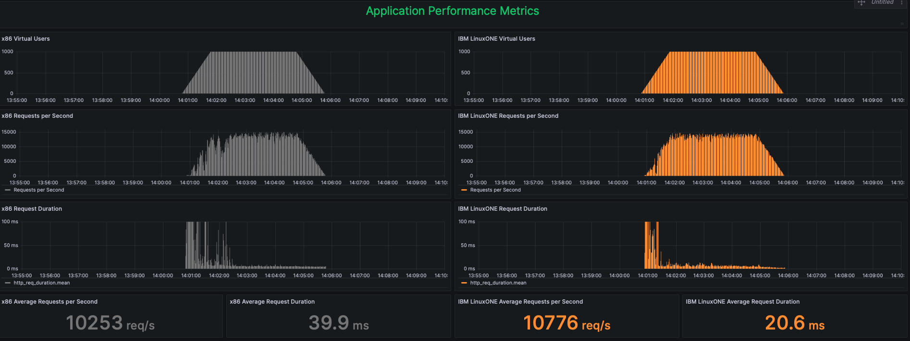
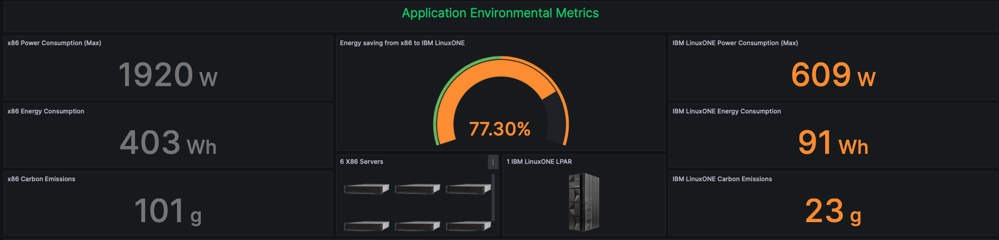
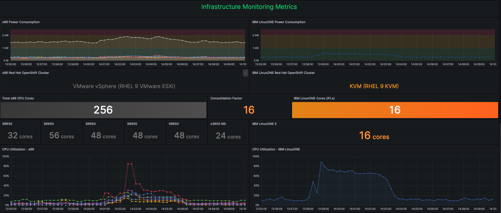
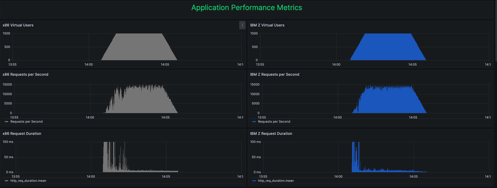
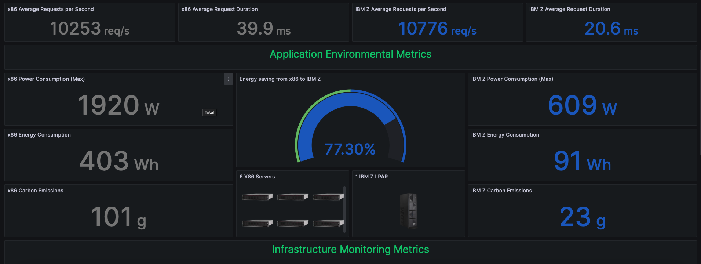
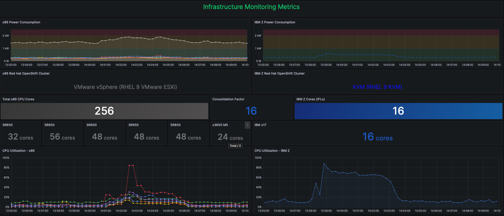

# IT Optimization Dashboards

Dashboards showing the migration from x86 to IBM LinuxONE and x86 to IBM Z displaying the core consolidation, performance and energy savings.

## How to Use

1. Import either the [IT Optimization with IBM LinuxONE dashboard](dashboards/IT%20Optimization%20with%20IBM%20LinuxONE.json) or the [IT Opimization with IBM Z dashboard](dashboards/IT%20Optimization%20with%20IBM%20Z.json) depending on your setup.

2. replace `data source` with your data source settings.

## Migrating from x86 to IBM LinuxONE

Use the [IT Optimization with IBM LinuxONE dashboard](dashboards/IT%20Optimization%20with%20IBM%20LinuxONE.json)

### Example of the Dashboard in Action

Here are images of what the dashboard looks like:

Additionally, here is a link to a live snaspshot of the dashboard from when a test was run: [https://ibm.biz/it-optimization-linuxone-snapshot](https://ibm.biz/it-optimization-linuxone-snapshot)

## Migrating from x86 to IBM Z

Use the [IT Opimization with IBM Z dashboard](dashboards/IT%20Optimization%20with%20IBM%20Z.json)

### Example

Here are images of what the dashboard looks like:

Additionally, here is a link to a live snaspshot of the dashboard from when a test was run: [https://ibm.biz/it-optimization-ibmz-snapshot](https://ibm.biz/it-optimization-ibmz-snapshot)